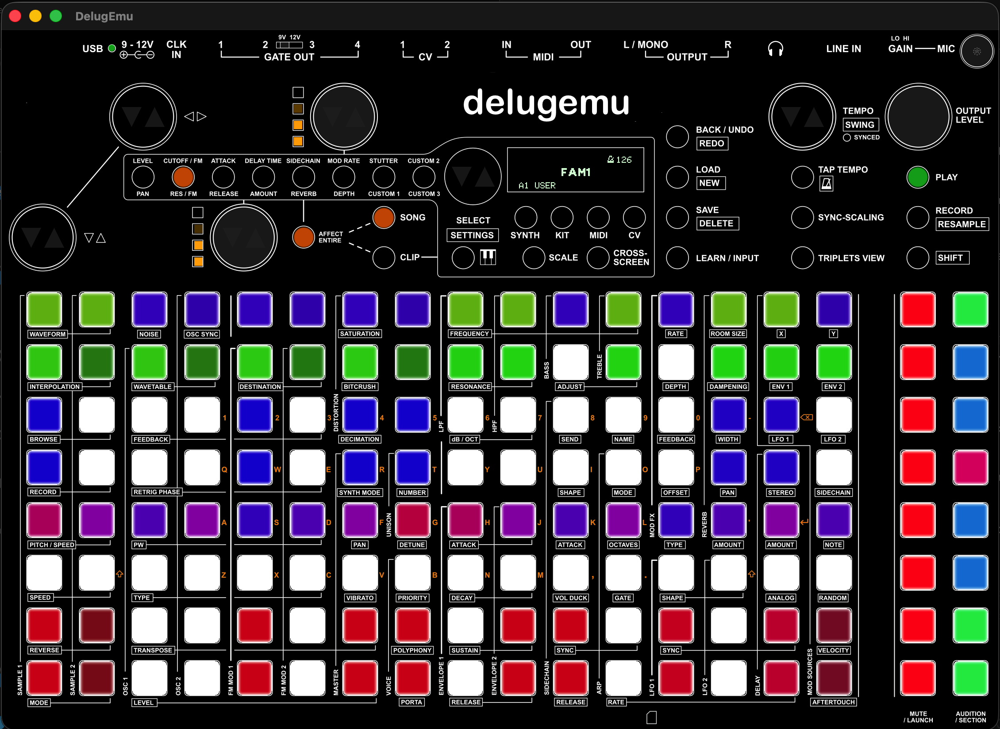

# delugemu

A hardware emulator for the [Synthstrom Audible Deluge](https://synthstrom.com/product/deluge/),
built as a custom machine model on top of [QEMU](https://www.qemu.org/).



The goal is to boot unmodified Deluge firmware (the open-source
[DelugeFirmware](https://github.com/SynthstromAudible/DelugeFirmware)) in a
fully software-simulated environment so that development, debugging, automated
testing and CI can happen without physical hardware.

> Status: **largely complete**. USB device/host support is not wired in to the host due to technical complexity. Development was done on a Mac Mini m4; Windows and Linux ports are pending.  Because the OLED display can emulate a 7-seg, the 7-seg device is just a stub. Outgoing MIDI works well; triggering MIDI on the Deluge emulator from an external source is a bit laggy.


## Target hardware

The Deluge is built around a **Renesas RZ/A1L** SoC:

| Component        | Detail                                                        |
| ---------------- | ------------------------------------------------------------- |
| CPU              | Arm Cortex-A9, single core, 400 MHz                           |
| On-chip SRAM     | 3 MB (mapped at `0x2000_0000`)                                 |
| External SDRAM   | 64 MB                                                          |
| Display          | OLED (128×48) **or** 7-segment array, depending on revision   |
| Input            | RGB pad matrix + encoders, handled by an auxiliary PIC MCU    |
| Audio            | I²S/SSI codec                                                 |
| Storage          | SD card                                                        |

Firmware runs bare-metal (no OS), in C/C++ with some Arm assembly.

See [docs/hardware.md](docs/hardware.md) for the full hardware breakdown and
[docs/memory-map.md](docs/memory-map.md) for the SoC memory map.

## How it works

QEMU does not ship with an RZ/A1L SoC or a Deluge board model. This project
keeps **vanilla upstream QEMU as a git submodule** and maintains the custom
hardware models under [`src/`](src). A small integration step links our sources
into the QEMU source tree and registers them with QEMU's Meson/Kconfig build, so
upstream stays untouched and easy to rebase.

```
firmware (.elf/.bin)
        │
        ▼
  ┌───────────────────────────────────────────┐
  │ qemu-system-arm -M deluge                  │
  │   ┌─────────────────────────────────────┐ │
  │   │ RZ/A1L SoC model (src/hw/arm)        │ │
  │   │  • Cortex-A9 + GIC + timers          │ │
  │   │  • 3 MB SRAM, 64 MB SDRAM            │ │
  │   │  • SCIF, SSI, SD, INTC               │ │
  │   └─────────────────────────────────────┘ │
  │   ┌─────────────────────────────────────┐ │
  │   │ Deluge board peripherals             │ │
  │   │  • PIC (buttons/pads/encoders)       │ │
  │   │  • OLED / 7-segment display          │ │
  │   │  • audio codec                       │ │
  │   └─────────────────────────────────────┘ │
  └───────────────────────────────────────────┘
```

See [docs/architecture.md](docs/architecture.md) for details.

## Prebuilt binaries

If you just want to run firmware without setting up a build toolchain, grab a
prebuilt bundle from the [Releases](https://github.com/gramster/delugemu/releases)
page. The macOS bundle is self-contained (the required libraries are vendored
alongside the binary), so no Homebrew or QEMU install is needed:

```sh
# Download DelugEmu-macos-<arch>.tar.gz from Releases, then:
tar -xzf DelugEmu-macos-arm64.tar.gz
cd DelugEmu-macos-arm64
./delugemu path/to/deluge_firmware.elf --sd deluge_sd.img
./delugemu --help
```

The build is ad-hoc signed but not notarized, so on first launch macOS Gatekeeper
may block it — allow it under **System Settings → Privacy & Security**, or clear
the quarantine attribute with `xattr -dr com.apple.quarantine <bundle-dir>`.

To produce a bundle yourself from a local build, run
[`./scripts/package.sh`](scripts/package.sh) (see [Building from source](#quick-start)
first).

## Quick start

```sh
# 1. Fetch the QEMU submodule (large, one-time)
./scripts/bootstrap.sh

# 2. Link our device models into the QEMU tree and configure the build
./scripts/integrate.sh

# 3. Build qemu-system-arm with the Deluge machine
./scripts/build.sh

# 4. Run firmware (opens the front-panel skin window by default)
./scripts/run.sh path/to/deluge_firmware.elf

# Options: attach an SD image, route MIDI to a chardev, add an audio
# backend, or pick a display mode (console/headless/none). See --help.
./scripts/run.sh path/to/deluge_firmware.elf --sd build/deluge_sd.img

# Audio plays on your speakers by default (the SSIF/I2S output opens the OS
# default backend: coreaudio on macOS, pa on Linux, dsound on Windows). Play a
# note in an instrument clip to get 44.1 kHz stereo. Pass --audio <driver> only
# to select a non-default backend (e.g. sdl / wav / none).
./scripts/run.sh path/to/deluge_firmware.elf --sd build/deluge_sd.img

# Output buffer: the SSIF keeps a small (~15 ms) cushion to absorb burst jitter.
# Raise it with --audio-buffer <ms> if you hear dropouts, or lower it to trim
# the delay when playing the emulated Deluge live from external MIDI.
./scripts/run.sh path/to/deluge_firmware.elf --midi coremidi --audio-buffer 15

# Run without a window (serial + monitor on the terminal):
./scripts/run.sh path/to/deluge_firmware.elf --display headless

# MIDI: on macOS, pass 'coremidi' to either MIDI flag to expose the Deluge as a
# real host MIDI in/out device (it appears in your DAW as "DelugEmu DIN" and/or
# "DelugEmu USB"). --midi is the DIN ports, --usb-midi is the USB-MIDI port. A
# small helper (scripts/midi_bridge.c, built automatically) bridges the byte
# stream to CoreMIDI virtual ports.
./scripts/run.sh path/to/deluge_firmware.elf --usb-midi coremidi --midi coremidi
```

## SD card image

The Deluge loads songs, synths, kits and samples from an SD card, so most of
the firmware (song load, audio playback, the file browser) only works with a
card attached. The card is a raw FAT32 disk image passed with `--sd` (or a
directory, which is snapshotted into one for you — see
[Folder-backed card](#folder-backed-card-no-manual-image) below).

If you don't pass `--sd`, `run.sh` automatically uses an `sdcard_rw` or `sdcard`
directory in the current working directory if one exists (the writable `_rw`
variant takes precedence). So from the repo root you can simply run with the
bundled factory content with no `--sd` flag at all.

QEMU's SD device requires the image to be **a power-of-two size** (e.g. 128 MiB,
256 MiB, 512 MiB, 1 GiB); a non-power-of-two image is rejected with
`Invalid SD card size`.

The easiest way is the helper script, which sizes the image correctly for you:

```sh
# Build build/deluge_sd.img from the bundled factory content in sdcard/
./scripts/mksd.sh

# Or from your own content directory, to a custom output path
./scripts/mksd.sh path/to/my_card_content build/my_sd.img
```

`mksd.sh` measures the content, adds slack, **rounds the capacity up to the next
power of two** (minimum 128 MiB), formats it FAT32 with volume label `DELUGE`,
and copies the directory contents to the root of the card. On macOS it uses the
built-in `hdiutil` / `newfs_msdos`; on Linux it needs `dosfstools` (`mkfs.fat`)
and `mtools` (`mcopy`) — install them with your package manager first.

Lay out the content directory like a real Deluge card (factory folders are in
[`sdcard/`](sdcard) to copy from):

```
SONGS/      Song .XML files
SYNTHS/     Synth preset .XML files
KITS/       Kit preset .XML files
SAMPLES/    Audio samples (.wav)
```

To build an image by hand instead, create a power-of-two raw image, format it
FAT32, and copy your content in:

```sh
# 256 MiB (= 2^28 bytes) raw image, FAT32, label DELUGE
dd if=/dev/zero of=build/deluge_sd.img bs=1m count=256

# macOS
dev=$(hdiutil attach -nomount -imagekey diskimage-class=CRawDiskImage build/deluge_sd.img | head -1 | awk '{print $1}')
newfs_msdos -F 32 -v DELUGE "$dev"
diskutil mount "$dev"            # then copy SONGS/ SYNTHS/ KITS/ SAMPLES/ into the mounted volume
diskutil unmount "$dev"; hdiutil detach "$dev"

# Linux (needs dosfstools + mtools)
mkfs.fat -F 32 -n DELUGE build/deluge_sd.img
mcopy -i build/deluge_sd.img -s SONGS SYNTHS KITS SAMPLES ::/
```

Then run with `--sd`:

```sh
./scripts/run.sh path/to/deluge_firmware.elf --sd build/deluge_sd.img
```

### Folder-backed card (no manual image)

Instead of an image file, `--sd` also accepts a **directory**. The folder is
snapshotted into a temporary FAT image at launch (using the same `mksd.sh`
sizing/rounding logic), so you don't have to build an image by hand:

```sh
./scripts/run.sh path/to/deluge_firmware.elf --sd path/to/card_folder
```

By default the snapshot is **read-only** with respect to your folder: the guest
can write to the card, but those changes live only in the temporary image and
are discarded on exit, leaving your folder untouched.

To have guest changes **written back** to the folder when the emulator quits,
name the folder so it ends in `_rw`:

```sh
./scripts/run.sh path/to/deluge_firmware.elf --sd path/to/card_folder_rw
```

On a clean exit the temporary image is mirrored back into the folder (files the
guest added or modified are copied in, files it deleted are removed), then the
temporary image is discarded. Write-back is best-effort and only happens on a
normal shutdown; if QEMU is killed, the folder is left as it was. On Linux,
write-back requires `mtools` (`mcopy`).

When invoked without `--sd`, `run.sh` looks for these folders by name in the
current working directory and auto-attaches the first it finds — `sdcard_rw`
(writable, changes mirrored back on exit) is tried before `sdcard`
(read-only snapshot).

## Controls

With the interactive skin window (`--display console`), the front panel is
driven by mouse and keyboard:

- **Click** a pad or button to press it (a momentary press/release). Clicking
  the silkscreen circle of an encoder presses it in.
- **Encoder rotation**: each of the six encoders has a small ▽ (left) and △
  (right) triangle inside its circle. Click ▽ to turn one detent CCW or △ to
  turn one detent CW; press and hold a triangle to repeat. The **mouse wheel**
  over an encoder also turns it.
- **Multi-press latch**: hold the **Left Alt/Option** key to latch clicks. While
  Alt is held, clicking a pad or button presses and *holds* it; clicking the
  same control again releases it. Releasing Alt drops every still-latched
  control at once. This lets a single mouse build chord-style combinations —
  e.g. hold several pads, or a pad together with a function button — that one
  pointer otherwise could not hold simultaneously.
- **Keyboard**: common controls are bound to keys — Space = PLAY, R = RECORD,
  Shift = SHIFT, Backspace = BACK, Enter = SELECT-encoder click, Tab =
  SESSION, C = CLIP, K = KEYBOARD, Q/W/E/T = SYNTH/KIT/MIDI/CV, and the number
  keys 1–8 trigger the sidebar audition column. See
  [src/hw/input/deluge_input.c](src/hw/input/deluge_input.c) for the full map.

## Repository layout

```
delugemu/
├── docs/                Hardware notes, architecture, roadmap
├── scripts/             bootstrap / integrate / build / run helpers
├── src/
│   ├── hw/              QEMU device & machine models (C)
│   │   ├── arm/         deluge board + RZ/A1L SoC container
│   │   ├── display/     OLED / 7-segment models
│   │   └── misc/        PIC and other board glue
│   └── include/hw/      Public headers for the models above
├── tests/               Emulation / regression tests
└── qemu/                Upstream QEMU (git submodule)
```

## Debugging & profiling

Firmware developers can attach GDB, capture exception/IO logs, run TCG
profiling plugins (hot blocks, hot pages, cache simulation), and drive the
panel over QMP. See [DEBUGGING.md](DEBUGGING.md) for verified commands.

## License

GPL-2.0-or-later, matching QEMU so the device models can link against it. See
[LICENSE](LICENSE).

The Synthstrom Deluge name and hardware are property of Synthstrom Audible Ltd.
This is an independent, unofficial project and is not affiliated with or
endorsed by Synthstrom Audible.
